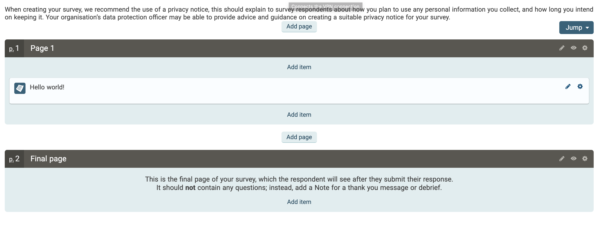

# JiscOnlineSurveySDK

This is an unofficial and incomplete development kit for https://onlinesurveys.ac.uk. This was created simply to complete my own task and therefor is missing the majority of implementations for each json class currently. See the to-do list for a feature list.

# Installation

Go supports modules since v1.11+. This package uses go-modules. Go modules require that GOPATH is empty =>  `unset GOTPATH`** 

## Installing the package with go

    go get github.com/DeanHnter/JiscOnlineSurveySDK

# Example

    package main
    
    import (
        "fmt"
        Surveys "github.com/DeanHnter/JiscOnlineSurveySDK"
    )
    
    func main() {
        survey := Surveys.CreateSurvey("Helloworld", Surveys.English)
        page1 := survey.AddPage("Page 1", Surveys.Show)
        page1.AddNote("Hello world!", Surveys.Show)
        survey.AddPage("Final page", Surveys.Show)
        json := survey.ToJson()
        fmt.Println(json)
        survey.Save("helloworld-survey.json", json)
    }

# To-DO status list

1. Page - Complete

2. MultipleChoice - Complete

3. SelectionOption - Complete

4. FreeText - Incomplete

5. MultipleAnswer - Incomplete

6. SelectionList - Incomplete

7. DatePicker - Incomplete

8. TimePicker - Incomplete

9. DateTimePicker - Incomplete

10. Scale - Complete

11. ScaleRow - Complete

13. Grid - Incomplete

14. GridRow - Incomplete

12. Note - Complete
